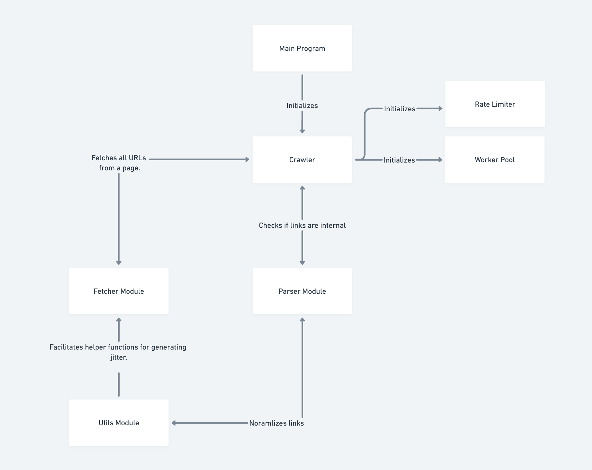

# Monzo Web Crawler

A highly extensible web crawler for discovering and indexing internal links on a given website. The crawler ensures robust error handling, configurable settings, and thread-safe operations, making it suitable for both small-scale and enterprise use cases.

## Features

- **Multi-threaded Crawling**: Uses a worker pool for concurrent crawling to maximize performance while avoiding server overload.
- **Configurable Parameters**: Customizable URL, depth, and request delay through command-line arguments.
- **URL Normalization**: Handles URLs with or without schemes and еnsures consistency by removing fragments, query parameters, and trailing slashes.
- **Retry Logic**: Retries failed requests with a configurable number of attempts facilitating exponenital backoff.
- **Internal Link Discovery**: Identifies internal links by comparing hostnames, avoiding recursion.
- **JSON Output**: Outputs discovered links as a JSON file.
- **Thread-Safe Structures**: Protects shared state with mutex locks for safe concurrent operations.

## System Design

The system is designed as a modular web crawler to enable flexibility, scalability, and separation of concerns. Each component has a specific responsibility, allowing for easier debugging, testing, and potential upgrades. Below is an explanation of the system components based on the provided architecture diagram:



### Components

1. **Main Class**:
   - Initializes the core components of the system: `Crawler`, `Rate Limiter`, and `Worker Pool`.
   - Passes runtime configurations (e.g., starting URL, max depth, delay) to the `Crawler`.
   - Orchestrates the overall flow of the crawling process.

2. **Crawler**:
   - Acts as the central module for managing the crawling process using recursion.
   - Handles URL normalization, depth calculation, and page processing.
   - Coordinates with `Fetcher` to retrieve page content and `Parser` to validate links.
   - Manages concurrency using the `Worker Pool` and ensures rate limits via the `Rate Limiter`.

3. **Fetcher Module**:
   - Fetches the content of a webpage by making HTTP requests.
   - Retries requests in case of failures and logs errors for URLs that fail after retries.
   - Error checks transient errors vs non-transient.
   - Returns all "valid" URLs found on the fetched page.

4. **Parser Module**:
   - Validates and normalizes the links provided.
   - Identifies internal links by comparing the hostname with the base URL.
   - Filters out external links and recursively visited paths to avoid duplicate crawling.

---

### Flow

1. **Initialization**:
   - The `Main Program` initializes the `Crawler`, `Rate Limiter`, and `Worker Pool`, and begins the crawling process with the starting URL.

2. **Fetching**:
   - The `Fetcher Module` retrieves the content of the given URL, including links found on the page.
   - If a fetch fails, it retries a configured number of times before logging an error.

3. **Parsing**:
   - The `Parser Module` processes the links fetched from the page.
   - It filters out external links, duplicate paths, and URLs with excluded file types (e.g., `.pdf`, `.jpg`).

4. **Recursive Crawling**:
   - The `Crawler` normalizes the URLs and determines if they should be processed further based on depth and duplicate checks.
   - Valid internal links are queued for crawling via the `Worker Pool`.

5. **Concurrency and Rate Limiting**:
   - The `Worker Pool` ensures that a limited number of URLs are crawled simultaneously, while the `Rate Limiter` enforces delays between requests.

6. **Output**:
   - The crawled URLs are stored in a thread-safe structure (`UsedURL`) and can be exported as JSON or other formats.

---

### Benefits of the Design

- **Modularity**: Each component (e.g., Fetcher, Parser) is independent and can be upgraded or replaced without affecting the rest of the system.
- **Scalability**: Concurrency management via the `Worker Pool` allows for scalable crawling across multiple domains or larger datasets.
- **Error Handling**: The `Fetcher` includes retries for failed requests, ensuring robustness during network errors or server downtime.
- **Extensibility**: Additional features (e.g., content extraction, database integration) can be added without major architectural changes.

---

### Trade-Offs in the Design

1. **Concurrency vs. Simplicity**:
   - Introducing a `Worker Pool` adds complexity to the implementation but ensures system stability under load.

2. **Rate Limiting vs. Speed**:
   - Rate limiting protects the target servers but slows down the crawling process.

3. **Normalization Overhead**:
   - URL normalization ensures consistency but introduces additional computational overhead.

4. **Retry Mechanism**:
   - Retrying failed requests improves reliability but can prolong execution time for unreachable URLs.

## Installation

### Prerequisites

- **Go**: Version 1.20 or later.
- **Git**: Ensure Git is installed for cloning the repository.

### Steps

1. Clone the repository:
   ```bash
   git clone https://github.com/ivan-vladimirov/monzo-web-crawler.git
   cd monzo-web-crawler
    ```
2. Build the application:
   ```bash
    make build
    ```
3. Run the crawler with your desired parameters:
   ```bash
    make run URL=http://example.com MAX_DEPTH=5 DELAY=200ms"
    ```
## Usage

### Command-Line Arguments (if running the binary directly)
For makefile please run ```make help```

| Parameter      | Description                          | Example              |
|----------------|--------------------------------------|----------------------|
| `-url`         | Starting URL for crawling            | `http://monzo.com`   |
| `-max-depth`   | Maximum depth for recursive crawling | `3`                  |
| `-output`      | Filename to output the results to    | `monzo_output.json`         |
| `-delay`       | Delay between requests               | `100ms`, `1s`        |

### Output

The crawler saves discovered links to a JSON file (`output.json`) in the following structure:
```json
{
  "urls": {
    "http://example.com": true,
    "http://example.com/about": true,
    "http://example.com/contact": true
  }
}
```
## Future Improvements

1. **Distributed Crawling**: 
   - Introduce support for distributed systems by allowing multiple crawler, fetcher, parser instances to work together on different segments of a website.
   - Use a message queue (e.g., RabbitMQ, Kafka) to distribute crawling tasks among workers.

2. **Enhanced URL Scheduling**: 
   - Implement priority-based URL scheduling to ensure high-value or frequently updated pages are crawled earlier.

3. **Improved Error Handling**:
   - Introduce a retry backoff strategy for transient errors and a mechanism to skip problematic URLs after a threshold is exceeded.
   - Log error to a centralised MQ to be consumed/checked/actioned etc.

4. **Centralised URL management**:
   - To improve the current centralised state management logic, I would implement a distributed database like Redis or Cassandra to track visited URLs across multiple crawlers, enabling scalability and reducing memory constraints. 

5. **Content Analysis**:
   - Integrate modules for content extraction and metadata analysis to provide more insightful outputs (e.g., detecting page types or extracting keywords).
   - Handle robots.txt ignoring 

6. **Enhanced Output**:
   - Provide multiple output formats like CSV, XML, or integration with databases for better data management.

7. **Robust URL Normalization**:
   - Improve URL normalization to handle even more edge cases.


## Trade-Offs

1. **Concurrency vs. Resource Usage**:
   - High concurrency improves speed but increases CPU and memory usage. Balancing these is crucial to avoid overwhelming the system or the target server.

2. **Retry Mechanism vs. Speed**:
   - Implementing retries improves reliability but can introduce delays and increase load on the server if retries are excessive or not tuned properly.

3.  **Centralised vs. Distributed State Management**:
    - Used a UsedURL struct with maps to track visited URLs and paths within the same instance.
    - Simple and effective for a single-node crawler. Easy to implement and debug. However, this is not scalable for distributed crawling, as maintaining a centralized state across multiple nodes would require significant synchronization overhead.

4. **Depth First Crawling**:
   - The Crawl function follows a recursive depth-first crawling approach vs breadth-first. Uses memory more efficiently but could miss broad exploration early, leading to slower discovery of high-priority links.


5. **Output Size vs. Usability**:
   - Storing all crawled URLs may produce large files, but limiting output can result in losing potentially valuable data.

6. **Hardcoded list of excluded file**:
    -  Lacks flexibility, requiring code changes to modify the list. Could be replaced with a configuration file or command-line parameter for better extensibility.

7. **Parser-Specific Path Tracking**
    - Keeps the parser modular and focused on its task. Increases complexity by managing multiple tracking mechanisms (e.g., URLs and paths) separately. Could be unified under a single tracking structure like UsedURL.

